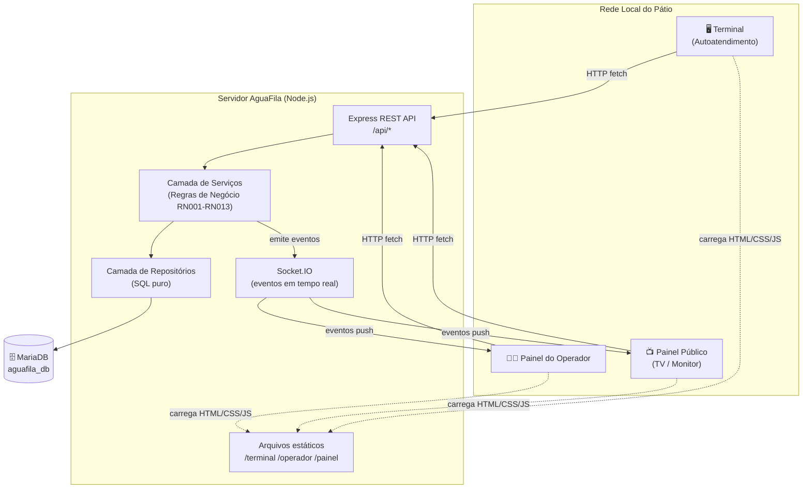
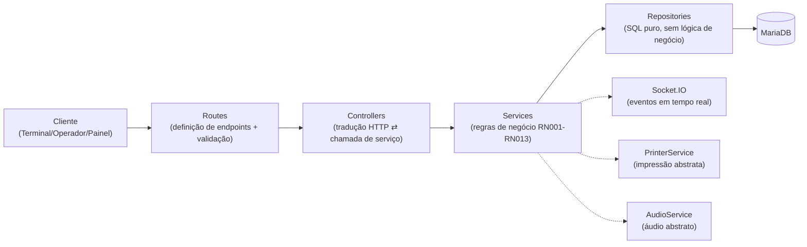
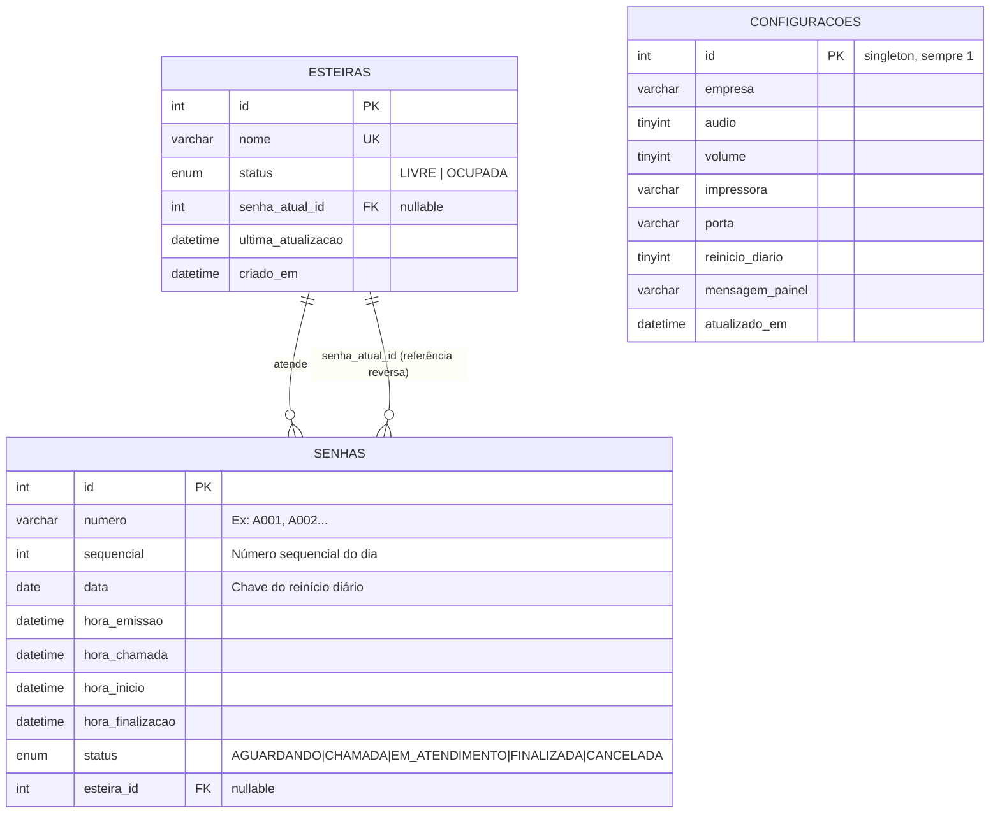
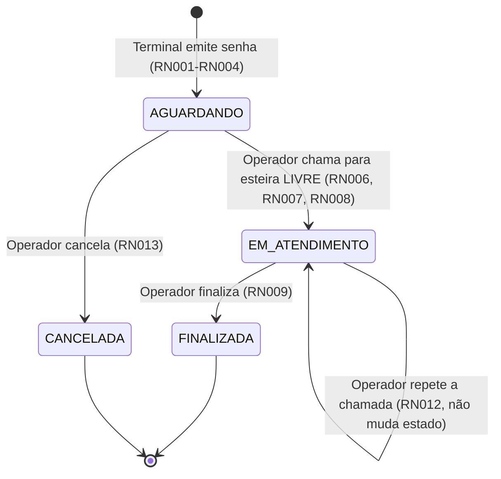
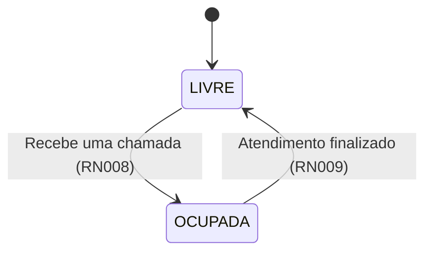
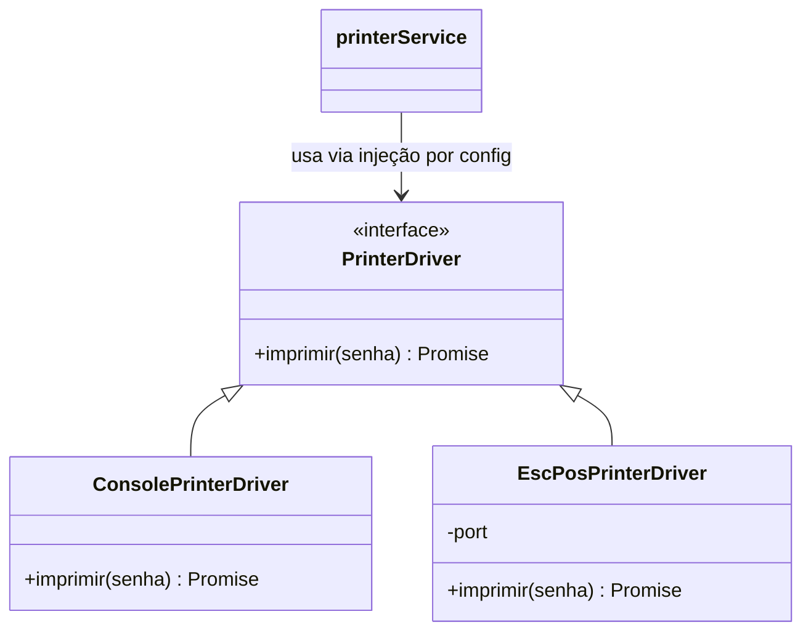
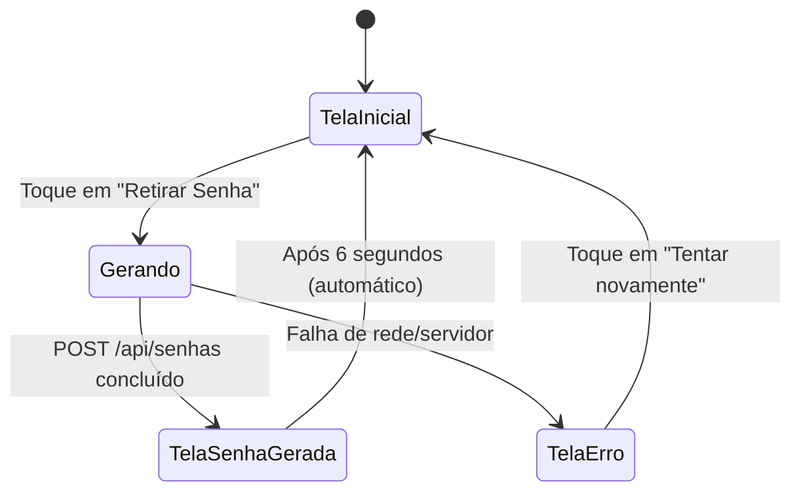
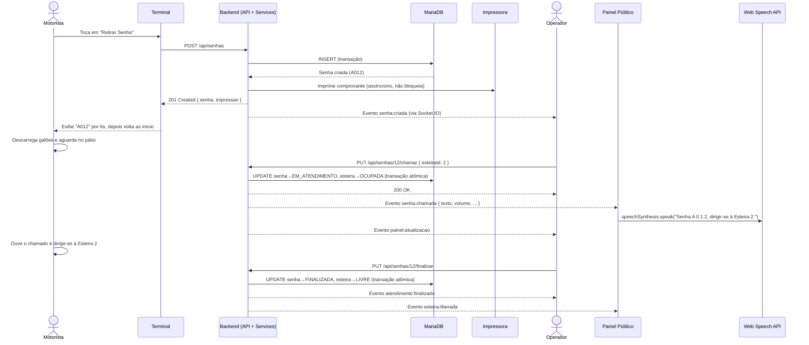

<div align="center">

# 💧 AguaFila
### Sistema de Gerenciamento de Atendimento para Distribuidoras de Água

**Documentação Técnica & Institucional — v1.0.0 (MVP)**

*Fila digital, chamada por esteira, painel público em tempo real e áudio automático — 100% em rede local, sem dependência de internet.*

---

`Backend: Node.js + Express` · `Banco: MariaDB` · `Tempo real: Socket.IO` · `Frontend: HTML/CSS/JS puro`

</div>

---

## Sumário

1. [Visão Geral do Produto](#1-visão-geral-do-produto)
2. [Arquitetura do Sistema](#2-arquitetura-do-sistema)
3. [Stack Tecnológica](#3-stack-tecnológica)
4. [Estrutura do Projeto](#4-estrutura-do-projeto)
5. [Modelo de Dados & Persistência](#5-modelo-de-dados--persistência)
6. [Módulos do Backend](#6-módulos-do-backend)
7. [Regras de Negócio](#7-regras-de-negócio)
8. [API REST — Referência Completa](#8-api-rest--referência-completa)
9. [Comunicação em Tempo Real (Socket.IO)](#9-comunicação-em-tempo-real-socketio)
10. [Frontend & Experiência do Usuário (UX)](#10-frontend--experiência-do-usuário-ux)
11. [Fluxo de Atendimento Ponta a Ponta](#11-fluxo-de-atendimento-ponta-a-ponta)
12. [Instalação, Configuração e Deploy](#12-instalação-configuração-e-deploy)
13. [Segurança, Limitações e Considerações Operacionais](#13-segurança-limitações-e-considerações-operacionais)
14. [📘 Manual do Usuário — Para a Empresa de Água](#14--manual-do-usuário--para-a-empresa-de-água)
15. [Guia para Colaboradores Open Source](#15-guia-para-colaboradores-open-source)
16. [Roadmap & Visão de Produto](#16-roadmap--visão-de-produto)
17. [Para Investidores — Leitura de Negócio](#17-para-investidores--leitura-de-negócio)
18. [FAQ — Perguntas Frequentes](#18-faq--perguntas-frequentes)
19. [Glossário](#19-glossário)
20. [Apêndices](#20-apêndices)

---

## 1. Visão Geral do Produto

### 1.1 O problema

Empresas distribuidoras de água que atendem caminhões e veículos para carregamento de galões operam, tradicionalmente, com **filas físicas informais**: motoristas descem do veículo, perguntam "quem é o próximo?", e a ordem de atendimento depende da memória do operador ou de papéis avulsos. Isso gera:

- Disputas e reclamações sobre ordem de chegada;
- Ociosidade de esteiras de carregamento por falta de coordenação;
- Nenhum rastro histórico de quantos atendimentos foram feitos, quando, ou quanto tempo cada um levou;
- Experiência de atendimento não profissional, sem comunicação visual/sonora clara.

### 1.2 A solução

O **AguaFila** digitaliza esse processo com um sistema de **três telas conectadas em tempo real**, rodando inteiramente na rede local da empresa (sem depender de internet):

| Tela | Papel | Quem usa |
|---|---|---|
| 🖥️ **Terminal de Autoatendimento** | Emite a senha do motorista, com impressão do comprovante | O motorista, ao chegar |
| 🧑‍💼 **Painel do Operador** | Mostra a fila, permite chamar, repetir e finalizar atendimentos | O funcionário responsável pelo pátio |
| 📺 **Painel Público** | TV/monitor visível no pátio, mostra a senha chamada com áudio | Todos os motoristas em espera |

Tudo se comunica **instantaneamente** via WebSocket (Socket.IO): quando o operador chama uma senha, o painel público e o áudio disparam no mesmo instante, sem necessidade de atualizar a página.

### 1.3 Proposta de valor

- ✅ **Zero-dependência de internet** — roda 100% em rede local (LAN), ideal para pátios industriais com conectividade limitada.
- ✅ **Zero-fricção de adoção** — sem cadastro de motoristas, sem login, sem curva de aprendizado: o motorista só aperta um botão.
- ✅ **Hardware simples** — qualquer computador ou tablet com navegador funciona como terminal, painel ou tela de operador.
- ✅ **Extensível por design** — impressora térmica e áudio são módulos plugáveis (Strategy Pattern), prontos para hardware real sem reescrever a aplicação.
- ✅ **Arquitetura enxuta e auditável** — código organizado em camadas (Clean Architecture / Service Layer / Repository Pattern), fácil de entender, testar e evoluir.

### 1.4 Estado atual (MVP)

O projeto está na fase de **MVP funcional**, cobrindo o ciclo essencial de emissão → fila → chamada → atendimento → finalização, com persistência real em banco de dados relacional e comunicação em tempo real ponta a ponta. Não inclui (ainda) autenticação, relatórios ou múltiplos operadores simultâneos — ver [Roadmap](#16-roadmap--visão-de-produto).

---

## 2. Arquitetura do Sistema

### 2.1 Visão macro

O sistema segue uma arquitetura **cliente-servidor clássica em camadas**, com um único processo Node.js servindo tanto a API REST quanto os arquivos estáticos das três interfaces, e mantendo conexões WebSocket abertas para difusão de eventos em tempo real.



### 2.2 Fluxo de dados em camadas (backend)

O backend segue rigorosamente o princípio de **responsabilidade única por camada**. Nenhuma regra de negócio vaza para fora de `services/`:



Essa separação está explicitada nos próprios comentários do código-fonte — por exemplo, em `senhaController.js`:

> *"SenhaController: traduz requisições HTTP em chamadas ao SenhaService. Nenhuma regra de negócio deve existir aqui."*

E em `senhaRepository.js`:

> *"Responsabilidade única: acesso a dados da tabela `senhas`. Nenhuma regra de negócio deve existir aqui (isso pertence aos Services)."*

### 2.3 Por que essa arquitetura importa

| Camada | Responsabilidade | Benefício arquitetural |
|---|---|---|
| **Routes** | Define endpoints e valida formato de entrada (`express-validator`) | Contrato de API explícito e auto-documentado |
| **Controllers** | Converte requisição HTTP em chamada de serviço e monta a resposta | Zero acoplamento entre protocolo HTTP e lógica de negócio |
| **Services** | Concentra 100% das regras de negócio (RN001–RN013) | Regras testáveis isoladamente, sem precisar de servidor HTTP rodando |
| **Repositories** | Executa SQL puro contra o MariaDB | Trocar de banco de dados no futuro não afeta regras de negócio |
| **Realtime (Socket.IO)** | Difunde eventos de mudança de estado | Desacopla "o que aconteceu" de "quem precisa saber" |
| **Printer/Audio Services** | Abstrações plugáveis (Strategy Pattern) | Trocar impressora ou modo de áudio não exige alterar regra de negócio |

### 2.4 Padrões de projeto aplicados

- **Service Layer** — toda regra de negócio isolada em `backend/services/`.
- **Repository Pattern** — todo acesso a dados isolado em `backend/repositories/`, com SQL parametrizado (proteção contra SQL Injection).
- **Strategy Pattern** — `PrinterDriver` e o modo de áudio (`tts` / `arquivo`) são estratégias intercambiáveis por configuração, sem alterar código de negócio.
- **Singleton** — o pool de conexões MariaDB (`config/database.js`) e a instância do Socket.IO (`realtime/socketManager.js`) são instâncias únicas compartilhadas por toda a aplicação.
- **Factory Method** — `printerService.js` decide, em tempo de execução, qual driver de impressora instanciar com base na variável de ambiente `PRINTER_DRIVER`.
- **Fail-fast** — o servidor testa a conexão com o banco de dados **antes** de aceitar requisições (`testConnection()` em `server.js`), evitando erros silenciosos em produção.
- **Transações atômicas** — qualquer operação que altere mais de uma tabela (ex.: chamar uma senha altera `senhas` **e** `esteiras`) é protegida por transação SQL (`withTransaction.js`), com `SELECT ... FOR UPDATE` para evitar condições de corrida entre chamadas simultâneas.

---

## 3. Stack Tecnológica

| Camada | Tecnologia | Motivo da escolha |
|---|---|---|
| **Backend** | Node.js + Express 4 | Leve, maduro, ecossistema enorme, fácil deploy em qualquer PC de pátio industrial |
| **Banco de dados** | MariaDB (MySQL-compatível) | Relacional, transacional (ACID), gratuito, roda localmente sem internet |
| **Driver de banco** | `mysql2/promise` | Suporte nativo a `async/await` e *prepared statements* parametrizados |
| **Tempo real** | Socket.IO 4 | WebSocket com fallback automático, API simples de pub/sub de eventos |
| **Validação** | `express-validator` | Validação declarativa de payloads na camada de rotas |
| **Frontend** | HTML5 + CSS3 + JavaScript ES6 *vanilla* | Sem build step, sem framework — roda em qualquer navegador, inclusive hardware modesto de pátio, **por especificação explícita do projeto** |
| **Síntese de voz** | Web Speech API (`speechSynthesis`) | Áudio de chamada 100% local no navegador, sem internet e sem arquivos de mídia |
| **Variáveis de ambiente** | `dotenv` | Configuração via `.env`, nunca hardcoded |
| **CORS** | pacote `cors` | Liberação controlada de origens na rede local |

### 3.1 Por que *vanilla JS* no frontend?

O `README.md` do projeto é explícito: *"Nenhum framework de frontend (React/Vue/Angular) é utilizado, conforme especificação."* Isso é uma decisão arquitetural deliberada, não uma limitação:

- **Zero build step** — não há `npm run build`, Webpack, Vite ou bundler. Os arquivos HTML/CSS/JS rodam diretamente no navegador.
- **Deploy trivial** — o próprio Express serve os arquivos estáticos (`express.static`); não existe pipeline de CI/CD obrigatório para colocar o sistema no ar.
- **Compatibilidade** — terminais de pátio, TVs e computadores antigos frequentemente têm navegadores desatualizados ou recursos limitados; JS puro reduz a superfície de possíveis incompatibilidades.
- **Manutenção de longo prazo** — sem risco de o projeto ficar "preso" a uma versão de framework que sairá de suporte.

### 3.2 Dependências de produção (backend)

```json
{
  "cors": "^2.8.5",
  "dotenv": "^16.4.5",
  "express": "^4.19.2",
  "express-validator": "^7.2.0",
  "mysql2": "^3.11.0",
  "socket.io": "^4.7.5"
}
```

Note a **enxutez proposital**: seis dependências de produção, todas maduras e amplamente auditadas. Isso minimiza a superfície de ataque (supply-chain) e a manutenção de longo prazo — um critério relevante tanto para times de engenharia quanto para due diligence técnica de investidores.

**Requisito de runtime:** Node.js `>= 18.0.0`.

---

## 4. Estrutura do Projeto

```
aguafila-mvp/
└── project/
    ├── backend/
    │   ├── app.js                      # Configuração do Express (middlewares, rotas, estáticos)
    │   ├── server.js                   # Ponto de entrada — sobe o HTTP server + Socket.IO
    │   ├── .env                        # Variáveis de ambiente (NÃO versionar em produção)
    │   ├── package.json
    │   │
    │   ├── config/
    │   │   ├── env.js                  # Único ponto de leitura de process.env
    │   │   └── database.js             # Pool de conexões MariaDB (singleton)
    │   │
    │   ├── routes/                     # Definição de endpoints REST + validação de entrada
    │   │   ├── index.js
    │   │   ├── senhaRoutes.js
    │   │   ├── esteiraRoutes.js
    │   │   ├── painelRoutes.js
    │   │   └── configRoutes.js
    │   │
    │   ├── controllers/                # Tradução HTTP ⇄ Service (sem regra de negócio)
    │   │   ├── senhaController.js
    │   │   ├── esteiraController.js
    │   │   ├── painelController.js
    │   │   └── configController.js
    │   │
    │   ├── services/                   # 100% das regras de negócio (RN001-RN013)
    │   │   ├── senhaService.js         # Núcleo do sistema — ciclo de vida da senha
    │   │   ├── esteiraService.js
    │   │   ├── painelService.js
    │   │   ├── configService.js
    │   │   ├── audioService.js         # Abstração de anúncio sonoro
    │   │   ├── printerService.js       # Abstração de impressão (Factory + Strategy)
    │   │   └── printer/
    │   │       ├── PrinterDriver.js         # Interface abstrata
    │   │       ├── ConsolePrinterDriver.js  # Driver de desenvolvimento (log no console)
    │   │       └── EscPosPrinterDriver.js   # Esqueleto para impressora térmica real
    │   │
    │   ├── repositories/                # SQL puro, sem regra de negócio
    │   │   ├── senhaRepository.js
    │   │   ├── esteiraRepository.js
    │   │   └── configRepository.js
    │   │
    │   ├── middlewares/
    │   │   ├── validate.js             # Converte erros do express-validator em ValidationError
    │   │   ├── errorHandler.js         # Middleware global de erros + 404
    │   │   └── requestLogger.js        # Log estruturado de cada requisição
    │   │
    │   ├── realtime/
    │   │   └── socketManager.js        # Singleton do Socket.IO + catálogo de eventos
    │   │
    │   ├── database/
    │   │   ├── migrate.js              # Executa sql/schema.sql via Node (npm run db:migrate)
    │   │   └── seed.js                 # Executa sql/seed.sql via Node (npm run db:seed)
    │   │
    │   └── utils/
    │       ├── AppError.js             # Hierarquia de erros de aplicação
    │       ├── asyncHandler.js         # Wrapper para evitar try/catch repetido
    │       ├── logger.js               # Logger estruturado sem dependências externas
    │       └── withTransaction.js      # Helper de transação atômica (BEGIN/COMMIT/ROLLBACK)
    │
    ├── frontend/
    │   ├── terminal/                   # Interface 1 — Terminal de Autoatendimento
    │   │   ├── index.html
    │   │   ├── css/terminal.css
    │   │   └── js/terminal.js
    │   ├── operador/                   # Interface 2 — Painel do Operador
    │   │   ├── index.html
    │   │   ├── css/operador.css
    │   │   └── js/operador.js
    │   ├── painel/                     # Interface 3 — Painel Público
    │   │   ├── index.html
    │   │   ├── css/painel.css
    │   │   └── js/
    │   │       ├── painel.js
    │   │       └── audio-player.js     # Reprodutor de áudio (TTS ou arquivos)
    │   └── assets/
    │       ├── css/base.css            # Design tokens compartilhados (cores, tipografia)
    │       ├── js/api.js               # Cliente HTTP compartilhado pelas 3 interfaces
    │       └── audio/README.md         # Instruções para o modo de áudio pré-gravado
    │
    ├── sql/
    │   ├── schema.sql                  # DDL — criação de banco, tabelas, índices, FKs
    │   └── seed.sql                    # Dados iniciais (esteiras + configuração padrão)
    │
    ├── docs/
    │   ├── API.md                      # Referência da API REST + eventos Socket.IO
    │   └── INSTALACAO.md               # Guia de instalação em rede local
    │
    ├── start-aguafila.bat              # Script Windows: sobe MariaDB + backend + abre as 3 telas
    └── README.md
```

### 4.1 Convenções de nomenclatura

O projeto adota **português** para nomes de domínio (variáveis, funções, rotas, colunas de banco) e **inglês** para termos técnicos genéricos (`AppError`, `asyncHandler`, `withTransaction`). Essa escolha é deliberada: o domínio é uma empresa brasileira de abastecimento de água, e a ubiquidade da linguagem de negócio no código (conceito de *Domain-Driven Design*) reduz a distância entre quem escreve a regra e quem a lê — seja um desenvolvedor, seja o dono da empresa revisando um relatório de bug.

---

## 5. Modelo de Dados & Persistência

### 5.1 Motor de banco de dados

**MariaDB** (compatível com MySQL), engine **InnoDB** (suporte transacional ACID e chaves estrangeiras), charset `utf8mb4` (suporte completo a acentuação e emojis, se necessário no futuro).

### 5.2 Diagrama Entidade-Relacionamento



> `CONFIGURACOES` é uma tabela **singleton** — existe apenas um registro (`id = 1`), representando a configuração global do sistema. Não há relacionamento com as demais tabelas.

### 5.3 Tabela `esteiras`

Representa as esteiras físicas de carregamento (ex.: "Esteira 1", "Esteira 2").

| Coluna | Tipo | Descrição |
|---|---|---|
| `id` | `INT UNSIGNED AUTO_INCREMENT` | Chave primária |
| `nome` | `VARCHAR(50)` **UNIQUE** | Nome de exibição da esteira |
| `status` | `ENUM('LIVRE','OCUPADA')` | Estado atual — default `LIVRE` |
| `senha_atual_id` | `INT UNSIGNED` (FK → `senhas.id`, nullable) | Senha sendo atendida no momento, se houver |
| `ultima_atualizacao` | `DATETIME` | Atualizado automaticamente (`ON UPDATE CURRENT_TIMESTAMP`) |
| `criado_em` | `DATETIME` | Timestamp de criação do registro |

### 5.4 Tabela `senhas`

O coração do sistema — cada linha é um ticket de atendimento.

| Coluna | Tipo | Descrição |
|---|---|---|
| `id` | `INT UNSIGNED AUTO_INCREMENT` | Chave primária |
| `numero` | `VARCHAR(10)` | Número formatado exibido ao motorista (ex.: `A012`) |
| `sequencial` | `INT UNSIGNED` | Contador puro do dia (1, 2, 3...) usado para gerar `numero` |
| `data` | `DATE` | Data de emissão — chave do reinício diário (RN003) |
| `hora_emissao` | `DATETIME` | Quando a senha foi gerada no terminal |
| `hora_chamada` | `DATETIME` (nullable) | Quando o operador chamou a senha |
| `hora_inicio` | `DATETIME` (nullable) | Início do atendimento (preenchido junto com a chamada) |
| `hora_finalizacao` | `DATETIME` (nullable) | Quando o atendimento foi concluído |
| `status` | `ENUM` | `AGUARDANDO`, `CHAMADA`, `EM_ATENDIMENTO`, `FINALIZADA`, `CANCELADA` |
| `esteira_id` | `INT UNSIGNED` (FK → `esteiras.id`, nullable) | Esteira que atendeu/atende esta senha |

**Restrições de integridade que implementam regras de negócio diretamente no banco:**

```sql
UNIQUE KEY uq_senhas_numero_data (numero, data)       -- RN004: não pode haver duas senhas iguais no mesmo dia
UNIQUE KEY uq_senhas_sequencial_data (sequencial, data)
KEY idx_senhas_status (status)
KEY idx_senhas_data (data)
KEY idx_senhas_data_status (data, status)
```

Essa é uma decisão de design notável: a regra **RN004 não depende apenas da lógica da aplicação** — está garantida também no nível do banco de dados via `UNIQUE KEY`, formando uma segunda camada de defesa contra inconsistências (por exemplo, em caso de bug futuro ou acesso direto ao banco).

### 5.5 Tabela `configuracoes`

| Coluna | Tipo | Descrição |
|---|---|---|
| `empresa` | `VARCHAR(150)` | Nome da empresa exibido no painel público |
| `audio` | `TINYINT(1)` | Liga/desliga o anúncio sonoro |
| `volume` | `TINYINT UNSIGNED` | Volume do áudio (0–100) |
| `impressora` | `VARCHAR(100)` | Driver de impressão ativo |
| `porta` | `VARCHAR(50)` (nullable) | Porta física da impressora (ex.: `COM1`) |
| `reinicio_diario` | `TINYINT(1)` | Se a numeração reinicia todo dia (RN003) |
| `mensagem_painel` | `VARCHAR(255)` | Mensagem institucional exibida no rodapé do painel público |

### 5.6 Máquina de estados da Senha

Este é o ativo mais crítico do sistema — todas as regras de negócio orbitam em torno dela.



> **Nota de implementação:** embora o enum do banco contemple o status `CHAMADA` como estado intermediário, a implementação atual do `senhaService.js` transiciona diretamente de `AGUARDANDO` para `EM_ATENDIMENTO` no momento da chamada (`hora_chamada` e `hora_inicio` são preenchidos juntos). O status `CHAMADA` está reservado no schema para uma futura separação entre "chamado" e "efetivamente em atendimento na esteira" — ver [Roadmap](#16-roadmap--visão-de-produto).

### 5.7 Máquina de estados da Esteira



### 5.8 Persistência e transações

Toda operação que altera **mais de uma tabela simultaneamente** é protegida por transação SQL explícita, via o helper `backend/utils/withTransaction.js`:

```js
async function withTransaction(fn) {
  const connection = await pool.getConnection();
  try {
    await connection.beginTransaction();
    const resultado = await fn(connection);
    await connection.commit();
    return resultado;
  } catch (error) {
    await connection.rollback();
    throw error;
  } finally {
    connection.release();
  }
}
```

Exemplos de uso crítico:

- **`gerarSenha()`** — lê o último sequencial do dia e insere a nova senha dentro da mesma transação, evitando que duas gerações simultâneas produzam o mesmo número.
- **`chamarSenha()`** — utiliza `SELECT ... FOR UPDATE` (via `esteiraRepository.buscarPorIdComLock`) para **bloquear a linha da esteira** durante a transação, impedindo que dois operadores (ou dois cliques simultâneos) chamem senhas diferentes para a mesma esteira ao mesmo tempo — uma condição de corrida clássica em sistemas de fila.
- **`finalizarAtendimento()`** — atualiza `senhas.status → FINALIZADA` e `esteiras.status → LIVRE` atomicamente.

### 5.9 Reinício diário da numeração (RN003)

A "data do dia" não é uma coluna calculada isoladamente — é a **chave de particionamento lógico** da fila. Toda consulta relevante (`buscarUltimoSequencialDoDia`, `listarPorData`) filtra por `data = hoje`, e a combinação `UNIQUE KEY (sequencial, data)` garante que a sequência sempre reinicia em `1` a cada novo dia, sem necessidade de um job agendado (*cron*) — o reinício é uma propriedade natural da consulta, não um evento a ser disparado.

---

## 6. Módulos do Backend

### 6.1 `config/` — Configuração centralizada

- **`env.js`** — único ponto de leitura de `process.env` em todo o sistema. Nenhum outro arquivo lê `process.env` diretamente; tudo passa por este módulo, com valores padrão sensatos e conversão de tipos (`toBool`, `toInt`). Isso facilita testes (basta mockar `env`) e auditoria de configuração (um único lugar para ver tudo que é configurável).
- **`database.js`** — cria e exporta o **pool de conexões** MariaDB (`mysql2/promise`), além de `testConnection()`, usada no boot do servidor para falhar rápido (*fail-fast*) se o banco estiver inacessível.

### 6.2 `routes/` — Contrato da API

Cada arquivo de rota mapeia verbos HTTP + path para um método de controller, com validação declarativa via `express-validator` diretamente na definição da rota (ex.: `param('id').isInt()`). As rotas **não contêm lógica** — apenas roteamento e validação de forma/tipo dos dados de entrada.

### 6.3 `controllers/` — Fronteira HTTP

Cada controller é uma coleção de funções `async` extremamente enxutas, todas envolvidas por `asyncHandler` (evita `try/catch` repetido e propaga exceções automaticamente ao middleware de erro). O papel do controller é estritamente:

1. Extrair dados da requisição (`req.params`, `req.body`, `req.query`);
2. Chamar o método correspondente do `service`;
3. Formatar a resposta no envelope padrão (`{ sucesso, dados }`).

### 6.4 `services/` — O núcleo do domínio

#### `senhaService.js` — o serviço mais importante do sistema

Implementa **todas** as regras RN001–RN013 (ver seção 7). Principais funções:

| Função | Regras aplicadas | O que faz |
|---|---|---|
| `gerarSenha()` | RN001–RN004, RN010, RN011 | Gera número sequencial do dia, persiste, aciona impressão, emite eventos |
| `listarFila({status})` | — | Lista as senhas do dia, com filtro opcional por status |
| `chamarSenha({senhaId, esteiraId})` | RN006–RN011 | Valida estado, transiciona senha→esteira atomicamente, dispara áudio e painel |
| `repetirChamada(senhaId)` | RN012 | Reemite áudio/evento sem alterar o estado |
| `finalizarAtendimento(senhaId)` | RN009 | Fecha o atendimento e libera a esteira |
| `cancelarSenha(senhaId)` | RN013 | Cancela uma senha ainda não atendida |

#### `esteiraService.js`

Camada fina sobre `esteiraRepository`, com tratamento de "não encontrado" (`NotFoundError`). A lógica de transição de status da esteira (LIVRE ⇄ OCUPADA) **não** vive aqui — vive em `senhaService`, porque a transição precisa ser atômica com a transição da senha.

#### `painelService.js`

Monta a "fotografia" consolidada exibida no painel público: esteiras + senha atual de cada uma, últimas 5 chamadas, mensagem institucional e nome da empresa. É **somente leitura** — não contém nenhuma regra de transição de estado, apenas agregação de dados de múltiplos repositórios via `Promise.all` (paralelização de queries).

#### `configService.js`

Leitura/atualização da configuração singleton, com **allowlist explícita de campos** (`CAMPOS_PERMITIDOS`) — proteção contra *mass assignment* (o cliente não pode injetar colunas arbitrárias no `UPDATE`).

#### `audioService.js` — abstração de anúncio sonoro

Desacoplado da regra de negócio: `senhaService` apenas chama `audioService.anunciarChamada(senha, esteira)`. Internamente, o serviço decide **como** produzir o áudio com base em `AUDIO_MODE`:

- **`tts`** (padrão) — monta o texto (`"Senha A 0 2 3, dirigir-se à Esteira 2."`) e emite via Socket.IO; o navegador do Painel Público sintetiza a voz localmente com a **Web Speech API**, sem internet.
- **`arquivo`** — monta uma lista de segmentos de áudio pré-gravados (`['senha', 'A', '0', '2', '3', 'dirigir-se-a', 'esteira-2']`) para o frontend concatenar e reproduzir em sequência.

Trocar o modo é uma mudança de **uma variável de ambiente**, sem tocar em `senhaService` nem em nenhum controller.

#### `printerService.js` + `services/printer/*` — abstração de impressão

Implementa o padrão **Strategy + Factory Method**:



- **`PrinterDriver`** define o contrato abstrato (`imprimir(senha)`), que qualquer driver concreto deve implementar.
- **`ConsolePrinterDriver`** é o driver padrão do MVP — "imprime" formatando um cupom de texto e enviando ao log do servidor. Permite rodar e testar o sistema **sem nenhum hardware físico**.
- **`EscPosPrinterDriver`** é o esqueleto documentado para uma impressora térmica real (USB/Serial/Rede via protocolo ESC/POS) — lança um erro explicativo caso seja usado sem implementação, orientando o desenvolvedor a completá-lo com uma biblioteca como `node-thermal-printer`.
- A falha de impressão **nunca bloqueia a emissão da senha** — a senha já está persistida no banco antes da tentativa de impressão; se a impressora falhar, o erro é logado e o motorista ainda recebe a senha na tela.

### 6.5 `repositories/` — Acesso a dados

Cada repositório expõe funções `async` que executam SQL parametrizado (proteção nativa contra SQL Injection via `?` placeholders do `mysql2`). Um detalhe importante de design: **toda função de repositório aceita um parâmetro opcional `connection = pool`**, permitindo que o mesmo código de acesso a dados seja reutilizado tanto fora de uma transação (usa o pool padrão) quanto dentro de uma (`withTransaction` passa a `connection` da transação ativa).

### 6.6 `middlewares/`

| Middleware | Função |
|---|---|
| `requestLogger.js` | Loga método, rota, status HTTP e tempo de resposta de cada requisição |
| `validate.js` | Converte falhas do `express-validator` em `ValidationError` (422) padronizado |
| `errorHandler.js` | Middleware global — converte qualquer erro lançado em uma resposta JSON consistente, evita vazamento de stack trace em produção, e nunca derruba o processo Node |

### 6.7 `realtime/socketManager.js`

Singleton que encapsula toda a interação com Socket.IO. Expõe apenas duas funções para o resto do sistema: `inicializar(httpServer)` (chamada uma vez, em `server.js`) e `emitir(evento, payload)` (chamada pelos services sempre que algo relevante acontece). Isso significa que **nenhum service conhece detalhes de WebSocket** — apenas dispara eventos nomeados, mantendo a camada de transporte totalmente substituível no futuro (ex.: trocar Socket.IO por Server-Sent Events) sem tocar em regra de negócio.

### 6.8 `utils/`

| Utilitário | Papel |
|---|---|
| `AppError.js` | Hierarquia de erros de aplicação: `AppError` (base), `NotFoundError` (404), `ValidationError` (422), `ConflictError` (409) |
| `asyncHandler.js` | Encaminha automaticamente exceções assíncronas de controllers para o middleware de erro |
| `logger.js` | Logger estruturado por nível (`error`/`warn`/`info`/`debug`), sem dependências externas |
| `withTransaction.js` | Wrapper de transação SQL com commit/rollback automático |

### 6.9 `database/` — scripts operacionais

`migrate.js` e `seed.js` são *scripts* Node (não uma ferramenta de migration versionada como Knex/Sequelize) que simplesmente leem e executam os arquivos `sql/schema.sql` e `sql/seed.sql` respectivamente, expostos via `npm run db:migrate` e `npm run db:seed`. Simples, transparente e sem *lock-in* de ferramenta — qualquer pessoa com acesso ao MariaDB consegue rodar os `.sql` manualmente também.

---

## 7. Regras de Negócio

Todas as regras abaixo estão implementadas em `backend/services/senhaService.js`, com transições de estado protegidas por transações de banco de dados para evitar condições de corrida (ex.: duas chamadas simultâneas para a mesma esteira).

| Código | Regra | Onde é garantida |
|--------|-------|-------------------|
| **RN001** | Existe apenas uma fila (não há filas por categoria/prioridade no MVP). | Modelagem — tabela `senhas` única, sem coluna de fila/categoria |
| **RN002** | As senhas são sequenciais. | `senhaRepository.buscarUltimoSequencialDoDia()` + coluna `sequencial` |
| **RN003** | A sequência reinicia diariamente. | Filtro por `data` em toda consulta de sequencial |
| **RN004** | Não pode haver duas senhas iguais no mesmo dia. | `UNIQUE KEY (numero, data)` **no schema do banco** — dupla proteção |
| **RN005** | Cada esteira atende apenas uma senha por vez. | Coluna `esteira_id` única por senha ativa + `senha_atual_id` na esteira |
| **RN006** | Somente senhas `AGUARDANDO` podem ser chamadas. | Validação explícita em `chamarSenha()`, lança `ConflictError` (409) |
| **RN007** | Somente esteiras `LIVRES` podem receber uma chamada. | Validação explícita + `SELECT ... FOR UPDATE` contra corrida |
| **RN008** | Ao chamar: senha → `EM_ATENDIMENTO`, esteira → `OCUPADA`. | Transação atômica em `chamarSenha()` |
| **RN009** | Ao finalizar: senha → `FINALIZADA`, esteira → `LIVRE`. | Transação atômica em `finalizarAtendimento()` |
| **RN010** | Toda chamada gera áudio. | `audioService.anunciarChamada()` invocado sempre após `chamarSenha()` |
| **RN011** | Toda chamada atualiza o painel instantaneamente. | Evento `painel:atualizacao` emitido via Socket.IO em toda mutação relevante |
| **RN012** | O operador pode repetir a chamada. | `repetirChamada()` — reforça áudio/painel sem mudar estado |
| **RN013** | O operador pode cancelar uma senha antes do atendimento. | `cancelarSenha()` — permitido apenas em status `AGUARDANDO` |

### 7.1 Anatomia de uma regra: `chamarSenha()`

Para ilustrar como as regras são aplicadas na prática, o trecho abaixo (simplificado) mostra RN006, RN007 e RN008 sendo verificadas e aplicadas dentro de uma única transação atômica:

```js
async function chamarSenha({ senhaId, esteiraId }) {
  return withTransaction(async (connection) => {
    const esteira = await esteiraRepository.buscarPorIdComLock(esteiraId, connection);
    if (esteira.status !== 'LIVRE') {
      throw new ConflictError(`Esteira "${esteira.nome}" já está OCUPADA.`); // RN007
    }

    const senha = await senhaRepository.buscarPorId(senhaId, connection);
    if (senha.status !== 'AGUARDANDO') {
      throw new ConflictError(`Senha "${senha.numero}" não está aguardando.`); // RN006
    }

    // RN008 — transição atômica dos dois estados:
    await senhaRepository.atualizarStatus(senhaId, 'EM_ATENDIMENTO', {...});
    await esteiraRepository.atualizarStatus(esteiraId, 'OCUPADA', senhaId);
  });
}
```

O uso de `buscarPorIdComLock` (que executa `SELECT ... FOR UPDATE`) garante que, se dois operadores tentarem chamar a **mesma esteira** no mesmo instante, a segunda transação aguardará a primeira terminar e então verá o status já atualizado para `OCUPADA` — falhando corretamente com `409 CONFLICT` em vez de corromper o estado.

### 7.2 O que está **fora** do escopo do MVP

Por decisão explícita de escopo (ver `README.md`, seção "Escopo do MVP"):

- Cadastro de clientes/motoristas
- Login/autenticação de operadores
- Histórico de atendimentos e relatórios gerenciais
- Dashboard administrativo com métricas
- Múltiplos operadores simultâneos com coordenação de concorrência entre pessoas (a proteção técnica contra corrida **existe** no banco, mas não há UX para múltiplos operadores)

Essas exclusões são tratadas em detalhe na seção [Roadmap](#16-roadmap--visão-de-produto).

---

## 8. API REST — Referência Completa

**Base URL:** `http://<servidor>:<porta>/api`

### 8.1 Envelope de resposta padrão

Toda resposta da API segue um formato consistente, o que simplifica enormemente o tratamento de erros no frontend (ver `assets/js/api.js`):

```jsonc
// Sucesso
{ "sucesso": true, "dados": { /* ... */ } }

// Erro
{ "sucesso": false, "erro": { "codigo": "CONFLICT", "mensagem": "..." } }
```

### 8.2 Recurso: Senhas

| Método | Rota | Descrição | Regras |
|---|---|---|---|
| `POST` | `/api/senhas` | Emite uma nova senha (Terminal) | RN001–RN004 |
| `GET` | `/api/senhas` | Lista senhas do dia atual. Filtro: `?status=AGUARDANDO` | — |
| `GET` | `/api/senhas/:id` | Busca uma senha específica | — |
| `PUT` | `/api/senhas/:id/chamar` | Chama a senha para uma esteira. Body: `{ "esteiraId": 1 }` | RN006–RN011 |
| `PUT` | `/api/senhas/:id/repetir` | Repete o áudio/painel sem mudar estado | RN012 |
| `PUT` | `/api/senhas/:id/finalizar` | Finaliza o atendimento | RN009 |
| `PUT` | `/api/senhas/:id/cancelar` | Cancela senha ainda `AGUARDANDO` | RN013 |

**Exemplo — `POST /api/senhas` → `201 Created`**

```json
{
  "sucesso": true,
  "dados": {
    "senha": { "id": 12, "numero": "A012", "status": "AGUARDANDO", "data": "2026-07-08" },
    "impressao": { "sucesso": true, "mensagem": "Impresso via driver console (simulação)." }
  }
}
```

### 8.3 Recurso: Esteiras

| Método | Rota | Descrição |
|---|---|---|
| `GET` | `/api/esteiras` | Lista todas as esteiras e seus estados |
| `GET` | `/api/esteiras/:id` | Busca uma esteira específica |

### 8.4 Recurso: Painel

| Método | Rota | Descrição |
|---|---|---|
| `GET` | `/api/painel` | Estado consolidado do painel público (esteiras + senha atual, últimas chamadas, mensagem institucional) |

**Exemplo de resposta:**

```json
{
  "sucesso": true,
  "dados": {
    "esteiras": [
      { "id": 1, "nome": "Esteira 1", "status": "OCUPADA", "senha_atual": { "numero": "A012" } },
      { "id": 2, "nome": "Esteira 2", "status": "LIVRE", "senha_atual": null }
    ],
    "ultimasChamadas": [{ "numero": "A011", "esteira_nome": "Esteira 2", "hora_chamada": "..." }],
    "mensagemPainel": "Bem-vindo! Aguarde a chamada da sua senha.",
    "empresa": "Empresa de Abastecimento de Água",
    "dataReferencia": "2026-07-08"
  }
}
```

### 8.5 Recurso: Configurações

| Método | Rota | Descrição |
|---|---|---|
| `GET` | `/api/configuracoes` | Retorna a configuração atual do sistema |
| `PUT` | `/api/configuracoes` | Atualiza um ou mais campos (todos opcionais) |

**Campos aceitos em `PUT`:** `empresa`, `audio`, `volume`, `impressora`, `porta`, `reinicio_diario`, `mensagem_painel`.

### 8.6 Códigos de erro

| HTTP | `codigo` | Significado | Quando ocorre |
|---|---|---|---|
| 404 | `NOT_FOUND` | Recurso não encontrado | Senha/esteira inexistente |
| 409 | `CONFLICT` | Violação de regra de estado | Esteira já ocupada, senha já chamada, etc. |
| 422 | `VALIDATION_ERROR` | Dados de entrada inválidos | Campo obrigatório ausente ou tipo incorreto |
| 500 | `INTERNAL_ERROR` | Erro inesperado no servidor | Falha de infraestrutura (ex.: banco fora do ar) |

---

## 9. Comunicação em Tempo Real (Socket.IO)

Conecte-se em `ws://<servidor>:<porta>` — o cliente Socket.IO é servido automaticamente em `/socket.io/socket.io.js`, sem configuração adicional.

| Evento | Quando ocorre | Payload principal | Quem escuta |
|--------|----------------|--------------------|---|
| `senha:criada` | Nova senha emitida no Terminal | `{ senha }` | Operador |
| `senha:chamada` | Senha chamada para uma esteira (inclui dados de áudio) | `{ senha, esteira, modo, texto, volume }` | Painel Público (dispara áudio) |
| `senha:repetida` | Operador repetiu a chamada | `{ senha, esteira }` | Operador, Painel |
| `senha:cancelada` | Senha cancelada antes do atendimento | `{ senha }` | Operador |
| `atendimento:finalizado` | Atendimento concluído | `{ senha, esteira }` | Operador, Painel |
| `esteira:liberada` | Esteira voltou ao estado `LIVRE` | `{ esteira }` | Operador, Painel |
| `painel:atualizacao` | Qualquer mudança relevante para o painel/operador | `{ motivo }` | Operador, Painel — evento "guarda-chuva" |

### 9.1 Padrão de atualização: "evento como gatilho, REST como fonte de verdade"

Um detalhe de design importante: os eventos Socket.IO **não carregam necessariamente todo o estado necessário para re-renderizar a tela**. Em vez disso, o padrão adotado (visível em `operador.js` e `painel.js`) é:

```js
['senha:criada', 'senha:chamada', ...].forEach((evento) => socket.on(evento, carregarTudo));
```

Ou seja: o evento funciona como um **"algo mudou, recarregue"**, e o cliente então busca o estado atualizado via `GET /api/painel` ou `GET /api/senhas`. Essa escolha simplifica o modelo mental (o servidor nunca precisa manter réplicas parciais de estado sincronizadas no payload do evento) ao custo de uma chamada REST extra por evento — uma troca perfeitamente razoável na escala de um MVP de pátio local, onde o volume de eventos é baixo (dezenas por hora, não milhares por segundo).

A exceção é o evento `senha:chamada`, que **carrega o payload de áudio diretamente** (`texto`, `modo`, `volume`, `segmentos`), pois o `AudioPlayer` precisa reagir imediatamente, sem esperar um round-trip HTTP adicional.

---

## 10. Frontend & Experiência do Usuário (UX)

### 10.1 Filosofia de design: "Vidro & Profundidade"

O próprio CSS documenta a direção visual adotada (`frontend/assets/css/base.css`):

> *"Vidro fosco flutuando sobre um fundo abissal com névoa de aurora aquática; um traço luminoso — a 'linha d'água' — assina cada tela e amarra as três interfaces como uma identidade única."*

Essa é uma identidade visual **deliberadamente premium** para um produto de infraestrutura industrial — uma escolha estratégica: sistemas de pátio costumam ter interfaces utilitárias e datadas; o AguaFila aposta em uma linguagem visual moderna (glassmorphism, gradientes sutis, tipografia editorial) para transmitir profissionalismo tanto ao motorista quanto à gestão da empresa.

### 10.2 Design tokens (paleta e tipografia)

| Token | Valor | Uso |
|---|---|---|
| `--abismo` | `#04101C` | Fundo escuro — telas públicas/kiosk (Terminal, Painel) |
| `--profundo` | `#0A2A47` | Superfícies elevadas sobre o abismo |
| `--gelo` | `#EEF4F8` | Canvas claro — uso prolongado (Operador) |
| `--turquesa` | `#22E6C4` | Cor de ação primária, estado "agora" |
| `--champanhe` | `#E3B567` | Acento institucional — "aguardando" |
| `--esmeralda` | `#2FD98A` | Estado "livre"/sucesso |
| `--coral` | `#FF5C72` | Cancelamento/erro |

| Fonte | Família | Uso |
|---|---|---|
| `--fonte-display` | Fraunces (serifada) | Títulos — peso institucional/editorial |
| `--fonte-texto` | Manrope | Corpo de texto e UI |
| `--fonte-numeros` | Bricolage Grotesque | Números de senha e relógios — números tabulares, alta legibilidade à distância |

A escolha de uma **fonte serifada para títulos** e uma **fonte grotesca numérica dedicada** para os números de senha não é acidental: números de senha precisam ser lidos rapidamente e à distância (no pátio, de dentro do caminhão), então recebem uma tipografia otimizada para isso, enquanto o restante da interface comunica robustez institucional.

### 10.3 As três interfaces

#### 🖥️ Terminal de Autoatendimento (`/terminal`)

**Público:** o motorista, sozinho, ao chegar ao pátio.

**Fluxo de tela:**



**Decisões de UX relevantes:**
- Botão único e grande (`Retirar Senha`) — sem menus, sem opções, minimizando erro de operação por usuários não técnicos.
- Retorno automático à tela inicial após 6 segundos — o terminal deve estar sempre pronto para o próximo motorista, sem depender de alguém "fechar" a tela anterior.
- Estado de carregamento explícito (botão desabilitado + `aria-busy`, texto muda para "Gerando senha...") — feedback imediato evita cliques duplicados (que gerariam senhas duplicadas desnecessárias).
- Relógio no cabeçalho, atualizado a cada 30s — orientação temporal passiva para quem aguarda.

#### 🧑‍💼 Painel do Operador (`/operador`)

**Público:** o funcionário responsável por coordenar o carregamento.

**Layout:** duas colunas —

1. **Fila de espera** — lista ao vivo de senhas `AGUARDANDO`, com contador e botão de cancelar por item.
2. **Esteiras** — cards por esteira, mostrando status (`Livre`/`Ocupada`), a senha atual (se ocupada) e as ações contextuais disponíveis:
   - Esteira livre → botão **"Chamar próxima (A0XX)"** (desabilitado se a fila estiver vazia);
   - Esteira ocupada → botões **"Repetir chamada"** e **"Finalizar atendimento"**.

Abaixo, uma seção de **"Últimas chamadas"** dá contexto histórico recente sem precisar de um relatório completo.

**Indicador de conexão** no cabeçalho (`Conectado`/`Desconectado`) — transparência sobre o estado do WebSocket, crítico em um sistema que depende de tempo real para funcionar corretamente.

Toda a tela se **re-renderiza automaticamente** a cada evento Socket.IO relevante — o operador nunca precisa apertar F5.

#### 📺 Painel Público (`/painel`)

**Público:** todos os motoristas aguardando no pátio, exibido em TV/monitor.

**Conteúdo:**
- Um card por esteira, mostrando a senha atual sendo atendida (destaque visual/pulsante quando é a mudança mais recente);
- Lista das últimas chamadas (contexto histórico visível a distância);
- Mensagem institucional configurável no rodapé;
- Nome da empresa e relógio no cabeçalho (atualizado a cada segundo).

**Áudio automático:** ao receber o evento `senha:chamada`, o `AudioPlayer` sintetiza a fala via Web Speech API. Por restrição de segurança dos navegadores (bloqueio de autoplay), o sistema exige **um toque inicial na tela** para "desbloquear" o áudio — documentado tanto no código (`audio-player.js`) quanto no manual operacional (seção 14).

### 10.4 Cliente HTTP compartilhado (`assets/js/api.js`)

As três interfaces compartilham um único cliente HTTP minimalista, sem dependências externas (usa `fetch` nativo). Um detalhe de resiliência de rede local: o cliente tenta múltiplas *base URLs* em sequência (`/api`, `http://localhost:3000/api`, `http://localhost:3001/api`), acomodando cenários em que o frontend é aberto separadamente do backend ou em portas alternativas (o próprio `server.js` já tem lógica de fallback de porta, ver seção 12).

### 10.5 Acessibilidade

- Uso de `aria-hidden` em elementos puramente decorativos (logotipo SVG, efeitos de fundo);
- `aria-busy` em botões durante operações assíncronas;
- `:focus-visible` com contorno de alto contraste (`--turquesa`) em todos os elementos interativos — importante para operadores que navegam por teclado.

---

## 11. Fluxo de Atendimento Ponta a Ponta



### 11.1 Passo a passo narrativo

1. **Chegada** — o motorista chega ao pátio e vai até o Terminal.
2. **Emissão** — toca em "Retirar Senha"; o sistema gera, persiste e imprime a senha (RN001–RN004).
3. **Espera** — o motorista descarrega os galões e aguarda no pátio, de olho no Painel Público.
4. **Chamada** — quando uma esteira fica livre, o operador chama a próxima senha da fila para aquela esteira (RN006–RN008).
5. **Anúncio** — o Painel Público destaca a senha chamada e o sistema reproduz o áudio *"Senha A023, dirigir-se à Esteira 2"* (RN010–RN011).
6. **Atendimento** — o motorista se dirige à esteira indicada e o carregamento é realizado fisicamente.
7. **Finalização** — o operador finaliza o atendimento; a senha vira `FINALIZADA` e a esteira volta a `LIVRE`, ficando disponível para a próxima chamada (RN009).

---

## 12. Instalação, Configuração e Deploy

### 12.1 Pré-requisitos

- **Node.js** 18 ou superior
- **MariaDB** 10.x instalado e em execução
- Rede local (Wi-Fi ou cabo) conectando o servidor aos terminais/painéis — **todos os dispositivos precisam alcançar o IP do servidor na mesma rede**

### 12.2 Passo a passo

**1) Banco de dados**

```bash
mysql -u root -p < sql/schema.sql
mysql -u root -p < sql/seed.sql
```

> Recomenda-se criar um usuário dedicado em vez de usar `root` em produção:
> ```sql
> CREATE USER 'aguafila_user'@'%' IDENTIFIED BY 'troque_esta_senha';
> GRANT ALL PRIVILEGES ON aguafila_db.* TO 'aguafila_user'@'%';
> FLUSH PRIVILEGES;
> ```

**2) Backend**

```bash
cd backend
cp .env.example .env      # ajuste usuário/senha do MariaDB
npm install
npm start
```

Saída esperada no console:

```
[INFO] Conectado ao MariaDB em 127.0.0.1:3306/aguafila_db
[INFO] Socket.IO inicializado.
[INFO] Servidor rodando em http://localhost:3000
```

**3) Acessando as interfaces**

O backend também serve os arquivos estáticos do frontend — **não é necessário nenhum servidor web adicional**.

| Interface | URL local | URL na rede (substitua pelo IP do servidor) |
|-----------|-----------|----------------------------------------------|
| Terminal | `http://localhost:3000/terminal` | `http://192.168.0.10:3000/terminal` |
| Operador | `http://localhost:3000/operador` | `http://192.168.0.10:3000/operador` |
| Painel | `http://localhost:3000/painel` | `http://192.168.0.10:3000/painel` |

Configure cada computador/dispositivo para abrir a URL correspondente em **modo tela cheia (kiosk)** no navegador.

### 12.3 Variáveis de ambiente (`.env`)

| Variável | Padrão | Descrição |
|---|---|---|
| `PORT` | `3000` | Porta do servidor HTTP (com fallback automático — ver 12.4) |
| `NODE_ENV` | `development` | Ambiente de execução |
| `DB_HOST` / `DB_PORT` / `DB_USER` / `DB_PASSWORD` / `DB_NAME` | — | Credenciais do MariaDB |
| `DB_CONNECTION_LIMIT` | `10` | Tamanho do pool de conexões |
| `CORS_ORIGIN` | `*` | Origem permitida (rede local fechada pode manter `*`) |
| `PRINTER_DRIVER` | `console` | `console` \| `escpos` \| `usb` \| `serial` \| `rede` |
| `PRINTER_PORT` | — | Porta física da impressora (ex.: `COM1`) |
| `AUDIO_MODE` | `tts` | `tts` (Web Speech API) \| `arquivo` (mp3 pré-gravados) |
| `AUDIO_VOLUME` | `100` | Volume padrão do anúncio (0–100) |
| `TOTAL_ESTEIRAS` | `2` | Referência informativa (as esteiras reais são as cadastradas no banco) |
| `REINICIO_DIARIO` | `true` | Habilita reinício diário da numeração (RN003) |
| `LOG_LEVEL` | `info` | `error` \| `warn` \| `info` \| `debug` |

### 12.4 Auto-seleção de porta

`server.js` implementa um mecanismo simples e robusto: tenta a porta configurada em `PORT` e, se estiver ocupada (`EADDRINUSE`), tenta automaticamente `3000, 3001, 3002...` em sequência — útil em ambientes de pátio onde múltiplos serviços podem já estar rodando na máquina.

### 12.5 Impressora térmica real

Por padrão, o driver `console` apenas registra o cupom no log — ideal para desenvolvimento/testes sem hardware. Para conectar uma impressora física, implemente um novo driver seguindo o contrato de `PrinterDriver.js` (veja o esqueleto em `EscPosPrinterDriver.js`, pronto para receber uma biblioteca ESC/POS como `node-thermal-printer`) e ajuste `PRINTER_DRIVER` no `.env`. **Nenhuma outra parte do sistema precisa ser alterada.**

### 12.6 Áudio

Por padrão, `AUDIO_MODE=tts`: o navegador do Painel Público sintetiza a voz localmente (Web Speech API), sem internet e sem arquivos de áudio. Navegadores exigem uma interação do usuário antes de permitir áudio automático — **um toque na tela do Painel Público, uma única vez após abri-la, desbloqueia o som**.

Para usar áudios pré-gravados em vez de TTS, veja `frontend/assets/audio/README.md` e ajuste `AUDIO_MODE=arquivo`.

### 12.7 Executando como serviço permanente

```bash
npm install -g pm2
pm2 start server.js --name aguafila
pm2 save
pm2 startup
```

### 12.8 Inicialização automatizada (Windows)

O repositório inclui `start-aguafila.bat`, que automatiza toda a rotina de abertura do sistema em uma máquina Windows: inicia o serviço MariaDB (ou `mysqld.exe` diretamente, se não houver serviço registrado), sobe o backend Node em uma nova janela de terminal e abre automaticamente as três telas (Terminal, Operador, Painel) no navegador padrão. Ideal para deixar pronto para o funcionário simplesmente dar dois cliques no ícone ao ligar o computador do pátio pela manhã.

### 12.9 Solução de problemas

| Sintoma | Causa provável |
|---|---|
| `Falha ao conectar ao MariaDB` no console | Credenciais erradas no `.env` ou serviço MariaDB parado |
| Painel/Operador não atualizam em tempo real | Firewall bloqueando a porta configurada na rede local |
| Terminal não imprime | Driver `PRINTER_DRIVER` não implementado para o hardware — verifique o log |
| Áudio não toca no painel | Nenhum toque inicial na tela (bloqueio de autoplay do navegador) |

---

## 13. Segurança, Limitações e Considerações Operacionais

> **Importante para avaliação técnica e de risco:** esta seção documenta honestamente as limitações atuais do MVP — informação essencial tanto para desenvolvedores quanto para decisões de investimento/adoção.

### 13.1 O que o MVP já garante

- **Proteção contra SQL Injection** — todas as queries usam *placeholders* parametrizados (`?`) via `mysql2`, nunca concatenação de strings.
- **Proteção contra condições de corrida** — transações atômicas + `SELECT ... FOR UPDATE` nas transições críticas de estado.
- **Integridade referencial no banco** — chaves estrangeiras (`FOREIGN KEY`) entre `senhas` e `esteiras`, com `ON DELETE SET NULL`/`ON UPDATE CASCADE` bem definidos.
- **Unicidade garantida em duas camadas** — RN004 (senhas duplicadas) é impedida tanto pela lógica de aplicação quanto por `UNIQUE KEY` no schema.
- **Tratamento de erro consistente** — nenhuma exceção não tratada derruba o processo; toda resposta de erro segue um formato JSON previsível.
- **CORS configurável** — origem restringível via `CORS_ORIGIN`, com liberação automática para hosts `localhost`/`127.0.0.1` (útil em desenvolvimento e em setups multi-porta na mesma máquina).

### 13.2 O que **não** está no MVP (limitações conhecidas)

- **Sem autenticação/autorização** — qualquer pessoa com acesso à rede local pode chamar as rotas `PUT` do operador (ex.: finalizar/cancelar senhas). Isso é aceitável em um pátio fechado com rede isolada, mas **não deve ser exposto à internet** sem adicionar uma camada de autenticação.
- **Sem HTTPS nativo** — o sistema roda em HTTP puro por padrão, adequado para rede local fechada; para exposição fora da LAN, seria necessário um proxy reverso com TLS (ex.: Nginx + Let's Encrypt).
- **Sem rate limiting** — não há proteção contra chamadas repetidas/abuso da API (novamente, mitigado pelo contexto de rede fechada).
- **Sem coordenação de múltiplos operadores** — a proteção técnica contra corrida existe no banco, mas não há indicação visual de "outro operador está agindo agora" na UI.
- **Sem testes automatizados** identificados no repositório atual — recomenda-se priorizar cobertura de testes unitários em `services/` (a camada mais crítica) antes de qualquer evolução significativa de escopo.
- **Sem histórico/relatórios** — dados de atendimentos anteriores existem no banco (`FINALIZADA`/`CANCELADA` não são apagados), mas não há nenhuma tela ou endpoint dedicado a consultá-los.

### 13.3 Recomendações antes de produção fora de ambiente controlado

1. Adicionar autenticação básica (ao menos) na tela do Operador.
2. Restringir `CORS_ORIGIN` a valores explícitos em vez de `*`.
3. Colocar o servidor atrás de um proxy reverso com HTTPS, caso o acesso deixe de ser estritamente LAN.
4. Adicionar suíte de testes automatizados, priorizando `senhaService.js` (regras RN001–RN013).
5. Implementar rotação/backup do banco de dados MariaDB.

---

## 14. 📘 Manual do Usuário — Para a Empresa de Água

> Esta seção **não exige nenhum conhecimento técnico**. Ela foi escrita para o dono da empresa, o gerente do pátio e o funcionário que vai operar o sistema no dia a dia.

### 14.1 Visão geral em 1 minuto

O AguaFila tem **três telas**, cada uma em um lugar diferente do pátio:

| Tela | Onde fica | Para que serve |
|---|---|---|
| 🖥️ **Terminal** | Perto da entrada, ao alcance do motorista | O motorista aperta um botão e retira sua senha |
| 🧑‍💼 **Operador** | Na mesa/guarita do funcionário responsável | O funcionário chama, repete e finaliza atendimentos |
| 📺 **Painel** | TV ou monitor grande, visível de longe no pátio | Mostra a senha chamada e anuncia por voz |

As três telas **conversam entre si automaticamente**. Quando o operador chama uma senha, o painel e o som atualizam **na hora**, sem precisar apertar nada.

### 14.2 Preparando o dia de trabalho

1. Ligue o computador/servidor que roda o sistema (ou o computador principal do pátio).
2. Se houver o atalho **"Aguafila"** na área de trabalho (Windows), dê **dois cliques** nele — ele liga o banco de dados, o sistema e já abre as três telas sozinho.
3. Verifique se cada tela está aberta no equipamento certo:
   - **Terminal** → tablet/computador perto da entrada, em tela cheia.
   - **Operador** → computador do funcionário.
   - **Painel** → TV/monitor do pátio, em tela cheia.
4. **Na primeira vez que abrir o Painel no dia, toque uma vez na tela.** Isso "libera" o som do navegador — sem esse toque, o áudio das chamadas não vai funcionar (é uma proteção do próprio navegador contra sons automáticos indesejados, não é um defeito do sistema).
5. Confira, no canto superior da tela do Operador, se está escrito **"Conectado"** (bolinha verde). Se estiver **"Desconectado"**, veja a seção *["O que fazer se algo der errado"](#146-o-que-fazer-se-algo-der-errado)*.

### 14.3 Como o motorista retira a senha

1. O motorista chega ao pátio e vai até a tela do **Terminal**.
2. Ele toca no botão grande **"Retirar Senha"**.
3. A tela mostra o número da senha (ex.: `A012`) e, se a impressora estiver conectada, um comprovante é impresso automaticamente.
4. Depois de alguns segundos, a tela volta sozinha para o início, pronta para o próximo motorista.
5. O motorista guarda o comprovante, descarrega os galões e **aguarda no pátio, de olho no Painel**.

> 💡 Não é necessário nenhum cadastro, login ou informação do motorista — o processo é intencionalmente simples para não gerar filas na hora de tirar a senha.

### 14.4 Como o operador atende a fila

Na tela do **Operador**, você vê duas áreas:

- **À esquerda:** a lista de senhas aguardando, na ordem de chegada.
- **À direita:** um cartão para cada esteira, mostrando se está **Livre** ou **Ocupada**.

**Para chamar a próxima senha:**

1. Veja qual esteira está com o cartão **"Livre"**.
2. Clique no botão **"Chamar próxima"** dentro do cartão daquela esteira.
3. Pronto — o sistema automaticamente:
   - Marca a senha como sendo atendida naquela esteira;
   - Atualiza o Painel Público;
   - Toca o anúncio de voz: *"Senha A012, dirigir-se à Esteira 2."*

**Se o motorista não ouviu ou não apareceu:**

- Clique em **"Repetir chamada"**, no cartão da esteira. O anúncio de voz toca novamente, sem alterar nada no sistema.

**Quando o carregamento terminar:**

- Clique em **"Finalizar atendimento"** no cartão daquela esteira. A esteira volta a ficar **"Livre"** e já pode receber a próxima chamada.

**Se uma senha precisar ser cancelada** (ex.: o motorista foi embora sem esperar):

- Encontre a senha na lista de espera (à esquerda) e clique em **"Cancelar"** ao lado dela. O sistema pede uma confirmação antes de cancelar.

> ⚠️ Só é possível cancelar senhas que **ainda não foram chamadas**. Uma senha já chamada só pode ser finalizada normalmente.

### 14.5 O que aparece no Painel Público

O Painel, exibido na TV do pátio, mostra:

- Um cartão para cada esteira, com o número da senha sendo atendida no momento;
- A lista das últimas senhas chamadas, para quem perdeu o anúncio de voz;
- Uma mensagem de boas-vindas no rodapé (pode ser personalizada — veja abaixo);
- O relógio e o nome da empresa no topo.

Sempre que uma nova senha é chamada, o cartão da esteira correspondente **pisca/destaca** e o sistema **fala em voz alta** o número da senha e a esteira.

### 14.6 O que fazer se algo der errado

| Problema | O que fazer |
|---|---|
| A tela do Operador mostra **"Desconectado"** | Verifique se o computador/servidor principal está ligado e conectado à rede Wi-Fi/cabo do pátio. Se persistir, feche e reabra a página. |
| O som não toca no Painel | Toque uma vez em qualquer lugar da tela do Painel (bloqueio de som do navegador). Verifique também se o volume do computador/TV está ligado. |
| O Terminal não imprime a senha | A senha **ainda é gerada normalmente**, mesmo se a impressora falhar — o motorista pode ver o número na tela. Verifique se a impressora está ligada e com papel; se o problema continuar, avise o suporte técnico. |
| Uma esteira ficou "travada" como Ocupada mesmo sem ninguém sendo atendido | Use o botão **"Finalizar atendimento"** naquela esteira para liberá-la. |
| Preciso reiniciar tudo | Feche as janelas do sistema e dê dois cliques novamente no atalho **"Aguafila"** (Windows) ou reinicie o computador servidor. |

### 14.7 Personalizando o sistema

Através da API de configurações (uma tela administrativa dedicada não está incluída neste MVP, mas os dados já existem e podem ser ajustados por um técnico ou em uma futura tela de administração), é possível alterar:

- **Nome da empresa** exibido no Painel;
- **Mensagem institucional** do rodapé (ex.: "Boa tarde! Fique atento ao seu número.");
- **Ligar/desligar o áudio** e ajustar o **volume**;
- **Driver de impressora** ativo.

### 14.8 Rotina recomendada de fechamento do dia

O sistema **não exige nenhuma ação manual de fechamento** — a numeração de senhas reinicia sozinha no dia seguinte (voltando para `A001`), e todo o histórico do dia permanece salvo no banco de dados. Basta desligar os equipamentos normalmente ao final do expediente.

### 14.9 Perguntas comuns da equipe operacional

**"Se a luz cair no meio do dia, eu perco as senhas já emitidas?"**
Não. Todas as senhas ficam salvas no banco de dados assim que são geradas — apenas a tela precisa ser reaberta depois que a energia/rede voltar.

**"Posso ter mais de duas esteiras?"**
Sim, o número de esteiras é configurável no banco de dados (cadastro atual: 2 esteiras). Para adicionar mais, é necessário suporte técnico.

**"O motorista pode saber sua posição na fila antes de ser chamado?"**
Não no MVP atual — ele só recebe o número da senha e aguarda o anúncio. Essa é uma melhoria mapeada no roadmap (seção 16).

---

## 15. Guia para Colaboradores Open Source

### 15.1 Por que contribuir

O AguaFila resolve um problema real e concreto (fila de atendimento em pátio industrial) com uma arquitetura enxuta, didática e sem *vendor lock-in* — um ótimo projeto para praticar Clean Architecture, Service Layer e Repository Pattern em Node.js puro, sem a complexidade de um framework de frontend.

### 15.2 Preparando o ambiente local

```bash
git clone <url-do-repositorio>
cd aguafila-mvp/project

# Banco de dados
mysql -u root -p < sql/schema.sql
mysql -u root -p < sql/seed.sql

# Backend
cd backend
cp .env.example .env
npm install
npm run dev     # usa `node --watch` — reinicia automaticamente a cada alteração
```

### 15.3 Convenções de código

- **Português para domínio, inglês para infraestrutura genérica** — siga o padrão já estabelecido (ver seção 4.1).
- **Nenhuma regra de negócio em `controllers/` ou `repositories/`** — toda regra pertence a `services/`. Pull requests que violarem essa separação de camadas serão solicitados a refatorar antes do merge.
- **SQL sempre parametrizado** — nunca concatenar valores diretamente em queries.
- **Operações multi-tabela sempre em transação** — use `withTransaction()` para qualquer mutação que afete mais de uma tabela.
- **Comentários JSDoc curtos e objetivos no topo de cada função de serviço**, citando qual(is) regra(s) de negócio (RNxxx) aquela função implementa — siga o padrão já usado em `senhaService.js`.
- **Sem frameworks de frontend** — o frontend permanece HTML/CSS/JS vanilla por decisão arquitetural do projeto; propostas de migração para um framework devem ser discutidas como uma RFC separada, não misturadas a uma correção de bug.

### 15.4 Onde encontrar oportunidades de contribuição

| Área | Exemplos de contribuição |
|---|---|
| **Testes automatizados** | Testes unitários para `services/`, especialmente `senhaService.js` (RN001–RN013) |
| **Driver de impressora** | Implementar `EscPosPrinterDriver.js` com uma biblioteca real (ex.: `node-thermal-printer`) |
| **Acessibilidade** | Auditoria WCAG das três interfaces |
| **Internacionalização** | Extrair strings de UI para arquivos de tradução, mantendo `pt-BR` como padrão |
| **Observabilidade** | Métricas de tempo de espera médio, integração com ferramentas de log externas |
| **Documentação** | Exemplos de configuração para outros SOs (Linux/macOS), traduções deste documento |

### 15.5 Processo de contribuição

1. Abra uma *issue* descrevendo o problema ou melhoria antes de codificar mudanças grandes.
2. Crie um branch descritivo (`feature/driver-escpos-real`, `fix/race-condition-cancelar`).
3. Garanta que sua mudança respeita a separação de camadas (seção 2) e as regras de negócio (seção 7).
4. Descreva no Pull Request **quais regras de negócio (RNxxx) são afetadas**, se houver.
5. Aguarde revisão — PRs que introduzam regra de negócio fora de `services/` serão solicitados a ajustar antes do merge.

---

## 16. Roadmap & Visão de Produto

Com base no escopo explicitamente definido como "fora do MVP", o caminho natural de evolução do produto é:

### 16.1 Curto prazo (consolidação do MVP)

- [ ] Suíte de testes automatizados para a camada de serviços
- [ ] Tela administrativa para `configuracoes` (hoje só acessível via API)
- [ ] Implementação real de um driver ESC/POS para impressora térmica
- [ ] Indicador de posição estimada na fila, exibido ao motorista após retirar a senha

### 16.2 Médio prazo (operação profissional)

- [ ] **Autenticação de operador** (login simples, um usuário por turno)
- [ ] **Histórico e relatórios** — tempo médio de atendimento, volume diário/semanal, horários de pico
- [ ] **Dashboard administrativo** com métricas operacionais
- [ ] **Múltiplos operadores simultâneos** com UX de coordenação (ex.: indicação de "esteira sendo processada por outro operador agora")
- [ ] Suporte a **categorias de fila** (ex.: prioridade para clientes contratuais vs. avulsos) — hoje RN001 define fila única por design

### 16.3 Longo prazo (expansão de produto)

- [ ] Cadastro de clientes recorrentes (histórico por cliente, sem necessariamente exigir login no Terminal)
- [ ] Aplicativo mobile para o motorista acompanhar a fila remotamente antes de chegar ao pátio
- [ ] Multi-unidade — um mesmo painel administrativo gerenciando várias filiais/pátios
- [ ] API pública documentada (OpenAPI/Swagger) para integração com ERPs de terceiros
- [ ] Modo SaaS multi-tenant, hospedado, para atender múltiplas distribuidoras de água sem infraestrutura própria

---

## 17. Para Investidores — Leitura de Negócio

> Esta seção resume, em linguagem de negócio, os principais pontos de avaliação do ativo técnico.

### 17.1 Mercado endereçável

Distribuidoras de água (poços, minas d'água, revenda de água mineral em galões) que atendem caminhões/veículos em pátio são um segmento tipicamente **subatendido por software** — a maioria opera com processos manuais ou papel. É um padrão recorrente em setores de logística/distribuição de baixo ticket médio e alta operação: o AguaFila resolve um problema real com uma solução deliberadamente simples de adotar.

### 17.2 Por que a arquitetura é um ativo, não só um MVP funcional

- **Baixo custo de manutenção** — seis dependências de produção, sem framework de frontend a manter atualizado, sem build pipeline.
- **Portabilidade de infraestrutura** — roda em qualquer máquina com Node.js + MariaDB; não depende de nuvem, o que reduz o custo de adoção para o cliente final (a distribuidora de água) e reduz o custo operacional do provedor do software.
- **Extensibilidade planejada desde o início** — impressora e áudio já são módulos plugáveis; adicionar autenticação, relatórios ou multi-tenancy não exige reescrever o núcleo de regras de negócio, que já está isolado em `services/`.
- **Caminho claro para modelo SaaS** — a arquitetura atual (single-tenant, on-premise) é o ponto de partida natural para uma oferta hospedada multi-tenant (ver Roadmap 16.3), sem necessidade de reescrita do domínio.

### 17.3 Riscos técnicos identificados (transparência de due diligence)

| Risco | Severidade atual | Mitigação recomendada |
|---|---|---|
| Ausência de autenticação | Alta, se exposto fora de rede local | Adicionar camada de auth antes de qualquer deploy fora de LAN fechada |
| Ausência de testes automatizados | Média | Priorizar testes de `services/` antes de expandir escopo |
| Sem histórico/analytics ainda implementado | Baixa (dados já persistidos, só falta camada de leitura) | Endpoint de relatórios é uma extensão simples sobre o modelo de dados atual |
| Dependência de um único processo Node (sem alta disponibilidade) | Baixa, dado o contexto de rede local single-site | Relevante apenas se o produto evoluir para modelo hospedado multi-cliente |

### 17.4 Indicadores de maturidade de engenharia observados no código

- Separação de camadas rigorosa e consistentemente aplicada, com comentários explícitos reforçando os limites de responsabilidade;
- Uso correto de transações e *locking* pessimista (`SELECT ... FOR UPDATE`) em pontos de concorrência real — um detalhe frequentemente negligenciado em MVPs, presente aqui desde o início;
- Tratamento de erro centralizado e consistente, com hierarquia de exceções de domínio (`AppError`, `NotFoundError`, `ConflictError`, `ValidationError`);
- Design de UX já considera cenários de falha (impressora offline, WebSocket desconectado, bloqueio de autoplay de áudio) — sinal de que o time pensou em produção real, não apenas em demo.

---

## 18. FAQ — Perguntas Frequentes

**O sistema funciona sem internet?**
Sim. Todo o backend, banco de dados e comunicação em tempo real rodam na rede local. A única dependência externa opcional são as fontes web (Google Fonts) carregadas nos `<head>` dos HTMLs, que podem ser removidas para operação 100% offline (ver `docs/INSTALACAO.md`).

**Preciso de um servidor dedicado?**
Não necessariamente — qualquer computador com Node.js e MariaDB instalados, ligado à rede local do pátio, é suficiente para o volume operacional de um MVP.

**Dá para usar tablets em vez de computadores?**
Sim, desde que o tablet tenha um navegador moderno e acesso à rede local. O Terminal e o Painel foram desenhados pensando em telas de toque/kiosk.

**O que acontece se duas pessoas tentarem chamar a mesma esteira ao mesmo tempo?**
O sistema usa bloqueio de banco de dados (`SELECT ... FOR UPDATE`) para garantir que apenas uma das duas operações seja bem-sucedida; a outra recebe um erro claro de conflito (RN007).

**Como trocar a impressora térmica?**
Implementando um novo driver que siga o contrato de `PrinterDriver.js` e apontando a variável `PRINTER_DRIVER` para ele — nenhuma outra parte do sistema precisa mudar.

**O sistema guarda dados de motoristas?**
Não no MVP atual — nenhum dado pessoal é coletado. A senha é um número anônimo vinculado apenas a horários e status.

---

## 19. Glossário

| Termo | Significado |
|---|---|
| **Senha** | O "ticket" numerado (ex.: `A012`) que representa a posição de um motorista na fila |
| **Esteira** | Ponto físico de carregamento de galões de água |
| **RN** | Abreviação de "Regra de Negócio", numeradas RN001–RN013 |
| **Painel Público** | Tela (TV/monitor) exibida no pátio, visível a todos os motoristas |
| **TTS** | *Text-to-Speech* — síntese de voz a partir de texto, usada no modo de áudio padrão |
| **Fail-fast** | Padrão de projeto em que o sistema falha imediatamente (ex.: ao iniciar) em vez de continuar rodando em estado inconsistente |
| **Race condition** (condição de corrida) | Situação em que duas operações concorrentes disputam o mesmo recurso, podendo gerar inconsistência sem proteção adequada |
| **Singleton** | Padrão de projeto que garante uma única instância compartilhada de um recurso (ex.: pool de conexões) |
| **Strategy Pattern** | Padrão de projeto que permite trocar um comportamento (ex.: driver de impressora) sem alterar quem o utiliza |

---

## 20. Apêndices

### 20.1 Referência rápida de todas as regras de negócio

```
RN001  Existe apenas uma fila.
RN002  As senhas são sequenciais.
RN003  A sequência reinicia diariamente.
RN004  Não pode haver duas senhas iguais no mesmo dia.
RN005  Cada esteira atende apenas uma senha.
RN006  Somente senhas AGUARDANDO podem ser chamadas.
RN007  Somente esteiras LIVRES podem receber uma chamada.
RN008  Ao chamar: senha → EM_ATENDIMENTO, esteira → OCUPADA.
RN009  Ao finalizar: senha → FINALIZADA, esteira → LIVRE.
RN010  Toda chamada gera áudio.
RN011  Toda chamada atualiza o painel instantaneamente.
RN012  O operador pode repetir a chamada.
RN013  O operador pode cancelar uma senha antes do atendimento.
```

### 20.2 Estrutura resumida dos scripts npm (backend)

| Comando | Ação |
|---|---|
| `npm start` | Inicia o servidor em modo normal |
| `npm run dev` | Inicia com `node --watch` (reinício automático a cada alteração) |
| `npm run db:migrate` | Executa `sql/schema.sql` contra o banco configurado |
| `npm run db:seed` | Executa `sql/seed.sql` (esteiras + configuração padrão) |

### 20.3 Endpoints — visão consolidada

```
POST   /api/senhas
GET    /api/senhas
GET    /api/senhas/:id
PUT    /api/senhas/:id/chamar
PUT    /api/senhas/:id/repetir
PUT    /api/senhas/:id/finalizar
PUT    /api/senhas/:id/cancelar
GET    /api/esteiras
GET    /api/esteiras/:id
GET    /api/painel
GET    /api/configuracoes
PUT    /api/configuracoes
```

### 20.4 Documentos-fonte do repositório

Este documento consolida e expande o conteúdo original de `README.md`, `docs/API.md` e `docs/INSTALACAO.md`, adicionando análise arquitetural, diagramas, o manual operacional para a empresa de água e as leituras voltadas a colaboradores open-source e investidores.

---

<div align="center">

**AguaFila** · Documentação Técnica & Institucional v1.0.0
*Gerado a partir da análise completa do código-fonte do MVP*

</div>
